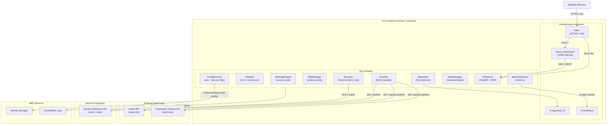
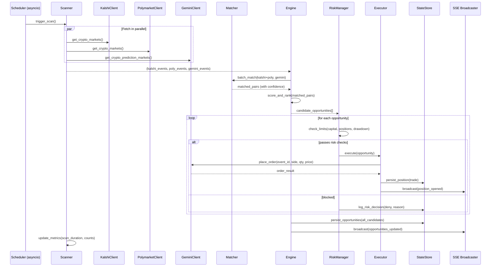
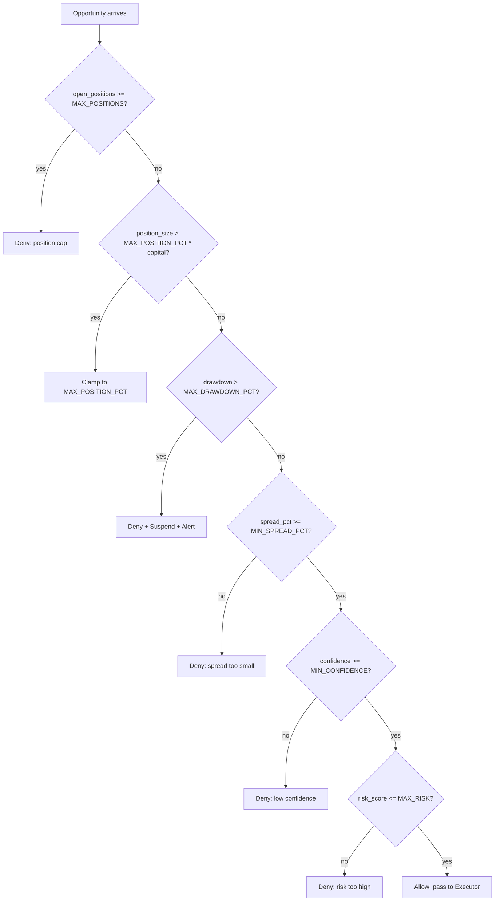

# Design Document: Prediction Arbitrage Production System

## Overview

The Prediction Arbitrage Production System is a hardened, observable Python service that scans
Kalshi and Polymarket as read-only price feeds, detects mispricings on Gemini Predictions, and
executes directional trades exclusively on Gemini Predictions. It runs as a Docker Compose stack
on a single EC2 instance and is observable via Prometheus metrics, structured JSON logs forwarded
to CloudWatch, and a real-time Next.js dashboard.

### Key Design Decisions

| Decision | Choice | Rationale |
|---|---|---|
| Language | Python 3.12 | Existing prototype is Python; rich async/HTTP ecosystem |
| Web framework | FastAPI | Async-native, built-in OpenAPI, SSE support via `sse-starlette` |
| Database | PostgreSQL 16 | Requirement 1.5 — production-grade, ACID, rich query support |
| ORM / migrations | SQLAlchemy 2 + Alembic | Type-safe models, migration history |
| Metrics | `prometheus-client` | Native Prometheus text format, zero extra infra |
| Dashboard | Next.js 14 (App Router) | Requirement 12.14 — React, SSE client, static export option |
| Secrets | AWS Secrets Manager via IAM profile | Requirement 6.3 — no static credentials |
| Logging | `structlog` → stdout JSON | Requirement 2.1, 8.9 — CloudWatch via `awslogs` driver |
| Containerisation | Docker Compose v2 | Requirement 8.4 — single-command deploy |
| TLS termination | nginx + certbot | Requirement 12.3 |
| PBT library | `hypothesis` | Mature, integrates with pytest |


---

## Architecture

### High-Level Component Diagram



### Scan Cycle Sequence



### Risk Manager Decision Flow




---

## Trading Strategy

### Strategy Classification

This is **statistical arbitrage / directional trading**, not risk-free arbitrage. We cannot
simultaneously buy YES on Gemini and sell YES on Kalshi — Kalshi and Polymarket are read-only
signal sources. We are making a directional bet that Gemini's price is wrong relative to the
consensus of more liquid markets, and that it will either converge before resolution or resolve
in the direction the reference price implies.

This means every trade carries two distinct risks:
1. **Convergence risk** — Gemini's price never converges; we hold to resolution.
2. **Resolution risk** — The event resolves against us regardless of what Kalshi/Poly said.

Both risks must be priced into position sizing.

---

### Data Collection Architecture

The system runs two parallel data loops at different frequencies:

**Slow loop (every `SCAN_INTERVAL_SECONDS`, default 300s):**
- Fetches full market lists from all three platforms via REST
- Runs event matching to find Kalshi/Poly ↔ Gemini pairs
- Writes matched pairs to the `matched_pairs` cache in memory

**Fast loop (every `PRICE_POLL_INTERVAL_SECONDS`, default 30s):**
- For every active matched pair, fetches fresh orderbook snapshots
- Updates `OrderbookSnapshot` records in the DB
- Computes `reference_price`, `gemini_ask`, `gemini_bid`, `spread`, `price_freshness_seconds`
- Triggers the engine to re-score and potentially execute

This separation means we don't re-run expensive LLM matching on every price tick, but we
always have fresh orderbook data before making a trade decision.

---

### Data Sources and Endpoints

#### Kalshi (read-only)

| Data | Endpoint | Auth | Frequency |
|---|---|---|---|
| Market list + mid prices | `GET /trade-api/v2/markets?series_ticker=KXBTCD` | None | Slow loop |
| Single market detail | `GET /trade-api/v2/markets/{ticker}` | None | On-demand |
| Full orderbook (bids + asks) | `GET /trade-api/v2/markets/{ticker}/orderbook` | None | Fast loop |
| Batch market prices | `GET /trade-api/v2/markets?tickers=T1,T2,...` | None | Fast loop (fallback) |
| Series list | `GET /trade-api/v2/series` | None | Slow loop (discovery) |
| Real-time orderbook deltas | `wss://api.elections.kalshi.com/trade-api/ws/v2` → `orderbook_delta` channel | RSA key | Optional streaming |
| Real-time ticker updates | `wss://api.elections.kalshi.com/trade-api/ws/v2` → `ticker` channel | None | Optional streaming |

Kalshi's orderbook response (`orderbook_fp`) contains `yes_dollars` and `no_dollars` arrays,
each a list of `[price_str, contracts_str]` pairs sorted ascending by price. The best bid is
the last element. Since binary markets sum to $1.00, the best YES ask = `1.00 - best_no_bid`.

```python
# Derived from orderbook_fp
best_yes_bid = Decimal(yes_dollars[-1][0])          # e.g. 0.4200
best_yes_ask = Decimal("1.00") - Decimal(no_dollars[-1][0])  # e.g. 1.00 - 0.5600 = 0.44
yes_mid = (best_yes_bid + best_yes_ask) / 2
depth_5pct = sum(Decimal(c) for p, c in reversed(yes_dollars)
                 if best_yes_bid - Decimal(p) <= Decimal("0.05"))
```

**Kalshi WebSocket orderbook delta protocol:**

When `KALSHI_WS_ENABLED=true`, the `KalshiClient` subscribes to the `orderbook_delta`
channel for all active matched tickers. Deltas are applied to a local in-memory orderbook
state, eliminating the need for REST polls between fast-loop ticks:

```python
# Subscribe message
{
    "id": 1,
    "cmd": "subscribe",
    "params": {
        "channels": ["orderbook_delta"],
        "market_tickers": ["KXBTCD-25MAR3195", "KXETHUSD-25MAR3200"]
    }
}

# Delta message (incremental update)
{
    "type": "orderbook_delta",
    "msg": {
        "market_ticker": "KXBTCD-25MAR3195",
        "price": "0.4300",
        "delta": "50",        # positive = add contracts, negative = remove
        "side": "yes"
    }
}

# Snapshot message (full state on subscribe)
{
    "type": "orderbook_snapshot",
    "msg": {
        "market_ticker": "KXBTCD-25MAR3195",
        "yes": [["0.40", "100"], ["0.42", "200"], ["0.43", "50"]],
        "no":  [["0.55", "150"], ["0.57", "80"]]
    }
}
```

#### Polymarket (read-only)

| Data | Endpoint | Auth | Frequency |
|---|---|---|---|
| Market list + metadata | `GET https://gamma-api.polymarket.com/markets` | None | Slow loop |
| Single market detail | `GET https://gamma-api.polymarket.com/markets/{conditionId}` | None | On-demand |
| Batch orderbooks | `POST https://clob.polymarket.com/books` (up to 500 token IDs) | None | Fast loop |
| Batch best bid/ask | `POST https://clob.polymarket.com/prices` (up to 500 token IDs) | None | Fast loop (lightweight) |
| Single orderbook | `GET https://clob.polymarket.com/book?token_id={id}` | None | On-demand |
| Market trades | `GET https://clob.polymarket.com/trades?market={conditionId}` | None | On-demand |
| Real-time orderbook | `wss://ws-subscriptions-clob.polymarket.com/ws/market` → `book` channel | None | Optional streaming |
| Real-time best bid/ask | `wss://ws-subscriptions-clob.polymarket.com/ws/market` → `best_bid_ask` channel | None | Optional streaming |
| Real-time trades | `wss://ws-subscriptions-clob.polymarket.com/ws/market` → `trade` channel | None | Optional streaming |

Polymarket's CLOB orderbook returns separate `bids` and `asks` arrays with `{price, size}` objects.
The `token_id` (from `conditionId` in Gamma API) is required for CLOB queries. The batch endpoint
accepts up to 500 token IDs in a single POST, making it efficient for polling many markets.

```python
# POST https://clob.polymarket.com/books
# Body: {"token_ids": ["token_id_1", "token_id_2", ...]}
# Response: [{"market": "...", "asset_id": "...", "bids": [...], "asks": [...]}]

best_bid = max(float(b["price"]) for b in bids) if bids else None
best_ask = min(float(a["price"]) for a in asks) if asks else None
mid = (best_bid + best_ask) / 2 if best_bid and best_ask else None

# depth_5pct: sum of sizes for bids within 5¢ of best_bid
depth_5pct = sum(float(b["size"]) for b in bids
                 if best_bid - float(b["price"]) <= 0.05) if best_bid else 0.0
```

**Polymarket WebSocket subscription protocol:**

When `POLYMARKET_WS_ENABLED=true`, the `PolymarketClient` subscribes to the `book` channel
for all active matched token IDs:

```python
# Subscribe message
{
    "auth": {},   # no auth required for public channels
    "type": "Market",
    "assets_ids": ["token_id_1", "token_id_2"]
}

# Book snapshot (on subscribe)
{
    "event_type": "book",
    "asset_id": "token_id_1",
    "market": "condition_id",
    "bids": [{"price": "0.68", "size": "500"}, ...],
    "asks": [{"price": "0.70", "size": "300"}, ...]
}

# Best bid/ask update (incremental)
{
    "event_type": "best_bid_ask",
    "asset_id": "token_id_1",
    "best_bid": "0.68",
    "best_ask": "0.70"
}
```

#### Gemini Predictions (read + write)

| Data | Endpoint | Auth | Frequency |
|---|---|---|---|
| Market list + prices | `GET https://api.gemini.com/v1/prediction-markets/events?status=active` | None | Slow loop |
| Single event detail | `GET https://api.gemini.com/v1/prediction-markets/events/{eventId}` | None | On-demand |
| Full orderbook depth | `GET https://api.gemini.com/v1/book/{instrumentSymbol}` | None | Fast loop |
| Recent trades | `GET https://api.gemini.com/v1/trades/{instrumentSymbol}` | None | On-demand |
| Live best bid/ask | `wss://ws.gemini.com` → `{symbol}@bookTicker` stream | HMAC-SHA384 | Continuous |
| Full orderbook stream | `wss://ws.gemini.com` → `{symbol}@depth` stream | HMAC-SHA384 | Optional |
| Place order | `POST https://api.gemini.com/v1/order/new` | HMAC-SHA384 | On execution |
| Cancel order | `POST https://api.gemini.com/v1/order/cancel` | HMAC-SHA384 | On exit |
| Order status | `POST https://api.gemini.com/v1/order/status` | HMAC-SHA384 | On-demand |
| Open orders | `POST https://api.gemini.com/v1/orders` | HMAC-SHA384 | On startup |
| Order fills | `wss://ws.gemini.com` → `orders@account` stream | HMAC-SHA384 | Continuous |

Gemini prediction markets use the same infrastructure as their crypto spot markets. The
`instrumentSymbol` field (e.g. `GEMI-PRES2028-VANCE`) is the trading symbol. The REST book
endpoint returns standard bid/ask arrays. The WebSocket `bookTicker` stream pushes top-of-book
updates in real time with fields `b` (best bid), `a` (best ask), `B` (bid qty), `A` (ask qty).

The `GeminiClient` maintains a persistent authenticated WebSocket connection for:
1. Streaming `{symbol}@bookTicker` for all active matched Gemini markets
2. Receiving `orders@account` fill notifications
3. Placing orders via `order.place` (lower latency than REST)

**Gemini orderbook depth computation:**

```python
# GET https://api.gemini.com/v1/book/{symbol}
# Response: {"bids": [{"price": "0.58", "amount": "150", ...}], "asks": [...]}

best_bid = float(bids[0]["price"]) if bids else None
best_ask = float(asks[0]["price"]) if asks else None
yes_mid = (best_bid + best_ask) / 2 if best_bid and best_ask else None

# depth_3pct_usd: USD value of ask-side liquidity within 3¢ of best ask
depth_3pct_usd = sum(
    float(a["price"]) * float(a["amount"])
    for a in asks
    if float(a["price"]) - best_ask <= 0.03
) if best_ask else 0.0
```

---

### Reference Price Construction

When both Kalshi and Polymarket have a matched event, we combine their prices into a single
reference signal. The aggregation strategy:

1. **Volume-weighted average (primary)**: Weight each platform's mid-price by its 24h volume.
   `ref_price = (kalshi_mid * kalshi_vol + poly_mid * poly_vol) / (kalshi_vol + poly_vol)`

2. **Single-source fallback**: If only one platform has the event, use that platform's mid directly.

3. **Disagreement flag**: If `|kalshi_mid - poly_mid| > 0.05` (5 cents), set `signal_disagreement=True`
   and reduce `match_confidence` by 0.10. Two liquid markets disagreeing by >5¢ is a signal that
   something unusual is happening (near-resolution, stale data, or genuine ambiguity).

4. **Liquidity weighting**: If one platform has `depth_5pct < 10` contracts, treat it as
   unreliable and fall back to the other platform's price only.

```python
def compute_reference_price(
    kalshi_ob: OrderbookSnapshot | None,
    poly_ob: OrderbookSnapshot | None,
) -> tuple[float, str, bool]:
    """Returns (ref_price, signal_platform, disagreement_flag)"""
    k_mid = kalshi_ob.yes_mid if kalshi_ob and kalshi_ob.depth_5pct >= 10 else None
    p_mid = poly_ob.yes_mid if poly_ob and poly_ob.depth_5pct >= 10 else None

    if k_mid is not None and p_mid is not None:
        disagreement = abs(k_mid - p_mid) > 0.05
        k_vol = kalshi_ob.volume_24h or 1.0
        p_vol = poly_ob.volume_24h or 1.0
        ref = (k_mid * k_vol + p_mid * p_vol) / (k_vol + p_vol)
        return ref, "both", disagreement
    elif k_mid is not None:
        return k_mid, "kalshi", False
    elif p_mid is not None:
        return p_mid, "polymarket", False
    else:
        raise ValueError("No liquid reference price available")
```

---

### Entry Logic

An opportunity passes entry checks only when ALL of the following hold:

1. **Spread threshold**: `|ref_price - gemini_mid| >= MIN_SPREAD_PCT` (default 8¢)
2. **Direction clarity**: `ref_price` and `gemini_mid` differ by more than the Gemini bid-ask spread
   (i.e., the signal is not inside Gemini's own spread noise)
3. **Price freshness**: Both the reference orderbook and Gemini orderbook were fetched within
   `MAX_PRICE_AGE_SECONDS` (default 60s). Stale prices are rejected outright.
4. **Gemini liquidity**: The Gemini orderbook has at least `MIN_GEMINI_DEPTH_USD` (default $50)
   of depth within 3¢ of the side we intend to buy. We cannot place $83 if there's only $20 available.
5. **Risk checks pass**: `RiskManager.evaluate()` returns `allowed=True`

**Direction determination**:
```python
def determine_direction(ref_price: float, gemini_mid: float) -> tuple[str, float]:
    """
    Returns (side, entry_price) where side is 'yes' or 'no'.

    If ref_price > gemini_mid: Gemini YES is underpriced → buy YES on Gemini
    If ref_price < gemini_mid: Gemini YES is overpriced → buy NO on Gemini
      (buying NO at price p is equivalent to buying YES at 1-p)
    """
    if ref_price > gemini_mid:
        # YES is cheap on Gemini relative to reference
        return "yes", gemini_ask   # pay the ask to get filled
    else:
        # NO is cheap on Gemini (YES is expensive)
        return "no", 1.0 - gemini_bid  # NO ask = 1 - YES bid
```

---

### Position Sizing (Corrected Kelly)

The prototype's Kelly formula was circular (using `spread_pct` as both win probability and
win amount). The corrected formula:

```
f* = (p * b - (1 - p)) / b

where:
  p = estimated win probability
  b = net odds (payout per dollar risked)
  f* = fraction of capital to bet
```

For a prediction market contract paying $1 on win:
- We buy YES at price `entry_price` (e.g. 0.58)
- If we win: profit = `1.0 - entry_price` = 0.42 per contract
- If we lose: loss = `entry_price` = 0.58 per contract
- So `b = (1.0 - entry_price) / entry_price`

Win probability `p` is estimated from the reference price:
- `p = ref_price` when buying YES (reference says event is more likely than Gemini thinks)
- `p = 1.0 - ref_price` when buying NO (reference says event is less likely than Gemini thinks)

```python
def kelly_fraction(ref_price: float, entry_price: float, side: str) -> float:
    """Compute Kelly fraction for a Gemini prediction market position."""
    if side == "yes":
        p = ref_price                          # prob of YES resolving
        b = (1.0 - entry_price) / entry_price  # net odds on YES
    else:  # "no"
        p = 1.0 - ref_price                    # prob of NO resolving
        b = (1.0 - entry_price) / entry_price  # net odds on NO (entry_price = NO ask)

    if b <= 0 or p <= 0:
        return 0.0

    f = (p * b - (1.0 - p)) / b

    # Apply fractional Kelly (0.25x) to account for model uncertainty
    # and cap at MAX_POSITION_PCT
    return max(0.0, min(f * 0.25, MAX_POSITION_PCT))
```

We use **quarter-Kelly** (0.25×) because our win probability estimate is derived from a
reference price that may itself be stale or wrong. Quarter-Kelly is standard practice when
the edge estimate has significant uncertainty.

---

### Exit Logic

Each position has an `exit_strategy` set at entry time:

**`hold_to_resolution` (default)**:
- Position is held until the event resolves on Gemini
- Gemini automatically settles winning contracts at $1.00
- No active monitoring needed beyond tracking fill status

**`target_convergence`**:
- Set when `days_to_resolution > CONVERGENCE_EXIT_DAYS` (default 7)
- `PositionMonitor` checks every `MONITOR_INTERVAL_SECONDS` (default 60s)
- Early exit triggered when: `|gemini_mid - ref_price| < CONVERGENCE_THRESHOLD` (default 2¢)
  AND the Gemini bid is above our entry price (we can exit profitably)
- Exit is executed by placing a limit sell order at the current Gemini bid
- If convergence never happens, falls back to hold-to-resolution

**Stop-loss**:
- If `gemini_mid` moves `STOP_LOSS_PCT` (default 15¢) against our position, exit immediately
- Example: bought YES at 0.58, ref was 0.72. If Gemini YES drops to 0.43 (0.58 - 0.15), exit.
- This caps the loss at `STOP_LOSS_PCT * quantity` rather than the full position value

```python
@dataclass
class ExitConditions:
    strategy: str              # "hold_to_resolution" | "target_convergence"
    target_exit_price: float   # price at which convergence exit triggers
    stop_loss_price: float     # price at which stop-loss triggers
    early_exit_enabled: bool   # False for near-resolution events
```

---

### P&L Model

**Hold-to-resolution path**:
```
gross_pnl = (1.0 - entry_price) * quantity   # if correct
gross_pnl = -entry_price * quantity           # if wrong
net_pnl = gross_pnl - (quantity * FEE_PER_CONTRACT)
```

**Convergence exit path**:
```
gross_pnl = (exit_price - entry_price) * quantity   # if YES
gross_pnl = (entry_price - exit_price) * quantity   # if NO (inverted)
net_pnl = gross_pnl - (quantity * FEE_PER_CONTRACT * 2)  # entry + exit fees
```

Gemini charges fees per contract. `FEE_PER_CONTRACT` is configurable (default 0.0).
Currently Gemini Predictions charges no maker/taker fees, but this may change.

---

### PositionMonitor Component

A separate asyncio task running every `MONITOR_INTERVAL_SECONDS` (default 60s):

```python
class PositionMonitor:
    async def run_once(self) -> None:
        positions = await self.state.get_open_positions()
        for pos in positions:
            ob = await self.gemini.get_orderbook(pos.instrument_symbol)
            if ob is None:
                continue

            gemini_mid = (ob.best_bid + ob.best_ask) / 2

            # Check stop-loss
            if self._stop_loss_triggered(pos, gemini_mid):
                await self.executor.close_position(pos, reason="stop_loss")
                continue

            # Check convergence exit
            if pos.exit_conditions.strategy == "target_convergence":
                if self._convergence_triggered(pos, gemini_mid, ob.best_bid):
                    await self.executor.close_position(pos, reason="convergence")
```

---

### Edge Cases

| Scenario | Handling |
|---|---|
| Inverted market (Gemini YES bid > YES ask) | Skip — data error; log WARNING |
| Near-resolution event (< 4h to expiry) | Set `early_exit_enabled=False`; hold to resolution only |
| Gemini depth < MIN_GEMINI_DEPTH_USD | Skip entry; log as `skipped_insufficient_liquidity` |
| ref_price inside Gemini spread | Skip entry; spread is noise, not signal |
| Signal disagreement (Kalshi vs Poly > 5¢) | Reduce confidence by 0.10; may still trade if above threshold |
| Both reference platforms down | Skip scan cycle; do not trade on stale data |
| Position fill partial | Track partial fill; size remaining capital correctly |
| Gemini WebSocket disconnect | Fall back to REST polling at `PRICE_POLL_INTERVAL_SECONDS`; reconnect with backoff |

---

## Components and Interfaces

### Directory Layout

```
prediction_arb/
├── bot/
│   ├── main.py                  # entrypoint: asyncio event loop, graceful shutdown
│   ├── config.py                # ConfigService: env + Secrets Manager loading
│   ├── scanner.py               # Scanner: slow-loop market list fetches
│   ├── price_poller.py          # PricePoller: fast-loop orderbook polling
│   ├── orderbook_cache.py       # OrderbookCache: in-memory snapshot cache per (platform, ticker)
│   ├── matcher.py               # EventMatcher: LLM/rule-based + TTL cache
│   ├── engine.py                # ArbitrageEngine: score, rank, filter
│   ├── risk.py                  # RiskManager: limits, drawdown, kill-switch
│   ├── executor.py              # Executor: Gemini order placement only
│   ├── monitor.py               # PositionMonitor: convergence + stop-loss exits
│   ├── state.py                 # StateStore: SQLAlchemy session factory
│   ├── models.py                # SQLAlchemy ORM models
│   ├── metrics.py               # Prometheus metrics registry
│   ├── alerts.py                # AlertManager: Slack/webhook/email
│   ├── api/
│   │   ├── server.py            # FastAPI app factory
│   │   ├── routes.py            # REST + SSE route handlers
│   │   └── sse.py               # SSE broadcaster (asyncio.Queue per client)
│   └── clients/
│       ├── base.py              # BaseClient: retry, backoff, latency metrics
│       ├── kalshi.py            # KalshiClient (read-only, REST + optional WS)
│       ├── polymarket.py        # PolymarketClient (read-only, REST + optional WS)
│       └── gemini.py            # GeminiClient (REST + persistent WS for prices/orders)
├── dashboard/                   # Next.js 14 app
│   ├── app/
│   │   ├── layout.tsx
│   │   ├── page.tsx             # root: status + positions + pnl chart
│   │   └── components/
│   │       ├── StatusPanel.tsx
│   │       ├── PositionsTable.tsx
│   │       ├── PnlChart.tsx
│   │       ├── OpportunitiesPanel.tsx
│   │       ├── TradesPanel.tsx
│   │       ├── RiskPanel.tsx
│   │       └── FeedHealthPanel.tsx
│   ├── lib/
│   │   ├── api.ts               # typed fetch wrappers
│   │   └── sse.ts               # SSE hook with reconnect backoff
│   └── Dockerfile
├── infra/
│   ├── docker-compose.yml
│   ├── nginx/
│   │   ├── nginx.conf
│   │   └── ssl/                 # cert + key (mounted volume)
│   ├── prometheus/
│   │   └── prometheus.yml
│   └── iam/
│       ├── policy.json          # minimal IAM policy
│       └── security-group.md   # port rules documentation
├── migrations/                  # Alembic migration scripts
│   ├── env.py
│   └── versions/
├── tests/
│   ├── unit/
│   ├── integration/
│   └── property/                # Hypothesis PBT tests
├── Dockerfile                   # multi-stage bot image
├── .env.template
└── alembic.ini
```

### Component Interfaces (Python signatures)

```python
# config.py
class ConfigService:
    def load(self) -> Config: ...          # raises SystemExit on missing required secrets
    def refresh_secrets(self) -> None: ... # called every 3600s by scheduler

# scanner.py
class Scanner:
    async def fetch_all(self) -> ScanResult: ...
    # ScanResult = dataclass(kalshi, polymarket, gemini, feed_health)

# matcher.py — see "Event Matcher Design" section for full interface
class EventMatcher:
    async def match(self, ref: MarketEvent, target: MarketEvent) -> MatchResult: ...
    async def batch_match(self, refs: list[MarketEvent], targets: list[MarketEvent],
                          min_confidence: float) -> list[MatchedPair]: ...
    async def warm_cache_from_db(self) -> int: ...
    @property
    def cache_hit_rate(self) -> float: ...

# engine.py
class ArbitrageEngine:
    def score(self, pairs: list[MatchedPair]) -> list[Opportunity]: ...
    def rank(self, opps: list[Opportunity]) -> list[Opportunity]: ...

# price_poller.py
class PricePoller:
    async def poll_once(self) -> list[OrderbookSnapshot]: ...
    # Fetches orderbooks for all active matched pairs; updates DB + in-memory cache

# orderbook_cache.py
class OrderbookCache:
    """In-memory cache of most recent OrderbookSnapshot per (platform, ticker)."""
    def update(self, snapshot: OrderbookSnapshot) -> None: ...
    def get(self, platform: str, ticker: str) -> OrderbookSnapshot | None: ...
    def get_all_for_pair(self, pair: MatchedPair) -> dict[str, OrderbookSnapshot | None]: ...
    def is_fresh(self, platform: str, ticker: str, max_age_seconds: int) -> bool: ...

# monitor.py
class PositionMonitor:
    async def run_once(self) -> None: ...
    # Checks all open positions for stop-loss and convergence exit conditions

# risk.py
class RiskManager:
    def evaluate(self, opp: Opportunity, portfolio: Portfolio) -> RiskDecision: ...
    # RiskDecision = dataclass(allowed: bool, reason: str, clamped_size: float | None)
    def is_suspended(self) -> bool: ...
    def resume(self) -> None: ...          # operator action to lift suspension

# executor.py
class Executor:
    async def execute(self, opp: Opportunity, size_usd: float) -> GeminiPosition: ...
    async def close_position(self, pos: GeminiPosition) -> None: ...

# state.py
class StateStore:
    async def save_opportunity(self, opp: Opportunity) -> None: ...
    async def save_position(self, pos: GeminiPosition) -> None: ...
    async def update_position(self, pos: GeminiPosition) -> None: ...
    async def get_open_positions(self) -> list[GeminiPosition]: ...
    async def get_pnl_history(self, from_ts: datetime, to_ts: datetime) -> list[PnlSnapshot]: ...
    async def get_aggregate_stats(self, window: timedelta) -> AggregateStats: ...

# api/sse.py
class SSEBroadcaster:
    async def publish(self, event_type: str, data: dict) -> None: ...
    async def subscribe(self) -> AsyncGenerator[str, None]: ...
```


### BaseClient: Retry and Resilience

All three platform clients inherit from `BaseClient`, which provides:

- **Retry logic**: up to 3 attempts with exponential backoff (1s, 2s, 4s) on timeout or 5xx
- **Rate-limit handling**: on HTTP 429, sleep for `Retry-After` header value (default 60s)
- **Latency recording**: wraps every request in a `arb_platform_api_latency_seconds` histogram observation
- **Consecutive failure tracking**: increments a per-platform counter; emits WARNING at 5 consecutive failures
- **Auth refresh**: calls `_reauthenticate()` on 401 before retrying once

```python
class BaseClient:
    MAX_RETRIES = 3
    BACKOFF_BASE = 1.0   # seconds

    async def _request(self, method: str, url: str, **kwargs) -> httpx.Response:
        for attempt in range(self.MAX_RETRIES):
            try:
                resp = await self._session.request(method, url, timeout=10, **kwargs)
                if resp.status_code == 429:
                    wait = int(resp.headers.get("Retry-After", 60))
                    await asyncio.sleep(wait)
                    continue
                if resp.status_code == 401 and attempt == 0:
                    await self._reauthenticate()
                    continue
                resp.raise_for_status()
                self._consecutive_failures = 0
                return resp
            except (httpx.TimeoutException, httpx.HTTPStatusError) as exc:
                self._consecutive_failures += 1
                if self._consecutive_failures >= 5:
                    logger.warning("platform_consecutive_failures",
                                   platform=self.platform_name, count=self._consecutive_failures)
                if attempt < self.MAX_RETRIES - 1:
                    await asyncio.sleep(self.BACKOFF_BASE * (2 ** attempt))
                else:
                    raise
```

### Event Matcher Design

The `EventMatcher` is the most intellectually complex component in the system. Its job is to
answer one question: *do these two events from different platforms resolve on the same outcome?*
Getting this wrong in either direction is costly — a false positive means we trade on a
non-existent spread; a false negative means we miss a real opportunity.

The matcher runs a **three-stage pipeline** for each event pair:

```
Stage 1: Rule-based pre-filter  →  fast, cheap, eliminates obvious non-matches
Stage 2: Structured extraction  →  parse asset, price level, direction, date from both titles
Stage 3: LLM semantic judgment  →  only called when rule-based score is ambiguous (0.4–0.75)
```

This keeps LLM calls to a minimum while using them exactly where they add value: resolving
ambiguous phrasings that rules can't handle.

---

#### Stage 1: Rule-Based Pre-Filter

Before any LLM call, the rule engine scores the pair on four independent dimensions. Each
dimension contributes a fixed weight to a `[0.0, 1.0]` confidence score:

| Dimension | Weight | Match condition |
|---|---|---|
| Asset symbol | 0.30 | Both titles reference the same crypto asset (BTC, ETH, SOL, etc.) |
| Price level | 0.35 | Extracted price levels are within 1% of each other |
| Direction | 0.15 | Both use "above"/"over"/"exceed" or both use "below"/"under"/"drop" |
| Resolution date | 0.20 | Parsed dates are within 3 days of each other |

**Routing logic based on rule score:**
- Score `< 0.40` → **reject immediately**, no LLM call (clearly different events)
- Score `0.40–0.74` → **send to LLM** for semantic judgment
- Score `≥ 0.75` → **accept as match**, no LLM call needed (high-confidence structural match)

This means the LLM is only invoked for the genuinely ambiguous middle band — typically
events with matching asset and price but slightly different phrasing or date formats.

```python
DIMENSION_WEIGHTS = {
    "asset":      0.30,
    "price":      0.35,
    "direction":  0.15,
    "date":       0.20,
}

RULE_REJECT_THRESHOLD = 0.40   # below this: skip LLM, reject
RULE_ACCEPT_THRESHOLD = 0.75   # above this: skip LLM, accept
```

---

#### Stage 2: Structured Extraction

Both event titles are parsed before scoring. Extraction is deterministic and runs in <1ms.

**Asset extraction** — canonical symbol lookup with word-boundary enforcement:
```python
ASSET_MAP = {
    "bitcoin": "BTC", "btc": "BTC",
    "ethereum": "ETH", "eth": "ETH", "ether": "ETH",
    "solana": "SOL", "sol": "SOL",
    "xrp": "XRP", "ripple": "XRP",
    "bnb": "BNB", "binance": "BNB",
    "avalanche": "AVAX", "avax": "AVAX",
    "cardano": "ADA", "ada": "ADA",
    "dogecoin": "DOGE", "doge": "DOGE",
}
# Short tickers (eth, sol, ada) require word-boundary match to avoid false hits
# e.g. "solana" matches "sol" but "resolution" does not
```

**Price level extraction** — handles all common formats:
```python
# Patterns matched (in priority order):
# "$95,000"  "$95k"  "$95K"  "95000"  "95,000"  "95k"  "0.95"
# Returns float in USD (k-suffix expanded: "95k" → 95000.0)
# Plausibility filter: 100 ≤ price ≤ 10_000_000 (rejects years, percentages, etc.)
```

**Direction extraction** — maps to canonical `"above"` or `"below"`:
```python
ABOVE_KEYWORDS = {"above", "over", "exceed", "surpass", "reach", "hit", "break",
                  "higher", "high", "top", "cross", "past", "ath"}
BELOW_KEYWORDS = {"below", "under", "drop", "fall", "crash", "low", "dip",
                  "beneath", "sink", "lose"}
# "reach" is above; "reach a low" is below — context window of ±2 words checked
```

**Date extraction** — tries fields first, then title parsing:
```python
# Field priority: end_date → expiry_date → resolution_date → close_time → endDateIso
# Title patterns: "March 31", "Mar 31", "31 March", "3/31", "Q1 2026", "end of March"
# All dates normalised to UTC date (time component stripped for comparison)
# "end of month" → last calendar day of that month
```

---

#### Stage 3: LLM Semantic Judgment

Called only when rule score is in the ambiguous band `[0.40, 0.75)`.

**Model selection:**

| Backend | Model | Latency | Cost | Use case |
|---|---|---|---|---|
| `openai` | `gpt-4o-mini` | ~400ms | ~$0.00015/call | Default; best cost/quality |
| `anthropic` | `claude-3-haiku-20240307` | ~500ms | ~$0.00025/call | Fallback if OpenAI down |
| `rule_based` | — | <1ms | $0 | No API key; lower accuracy |

**LLM Tooling Architecture — Function Calling Mode**

Rather than prompting the LLM to return free-form JSON and parsing it ourselves, both
backends use their native tool/function-calling APIs. This eliminates JSON parse errors
entirely: the API enforces the schema before returning a response.

**OpenAI function-calling schema:**

```python
MATCH_TOOL_SCHEMA = {
    "type": "function",
    "function": {
        "name": "match_event_pair",
        "description": (
            "Determine whether two prediction market events from different platforms "
            "resolve on the same underlying outcome. Focus on asset, price threshold, "
            "direction (above/below), and resolution date."
        ),
        "parameters": {
            "type": "object",
            "properties": {
                "equivalent": {
                    "type": "boolean",
                    "description": "True if both events resolve on the same outcome"
                },
                "confidence": {
                    "type": "number",
                    "description": "Confidence score 0.0–1.0"
                },
                "reasoning": {
                    "type": "string",
                    "description": "One-sentence explanation of the decision"
                },
                "asset": {
                    "type": "string",
                    "description": "Canonical asset symbol (BTC, ETH, SOL, etc.) or null"
                },
                "price_level": {
                    "type": ["number", "null"],
                    "description": "Extracted price threshold in USD, or null"
                },
                "direction": {
                    "type": "string",
                    "enum": ["above", "below", "null"],
                    "description": "Price direction: above, below, or null if unclear"
                },
                "resolution_date": {
                    "type": ["string", "null"],
                    "description": "ISO 8601 date (YYYY-MM-DD) or null"
                },
                "inverted": {
                    "type": "boolean",
                    "description": (
                        "True if one platform phrases the event as YES=above "
                        "and the other as YES=below (logical complement)"
                    )
                }
            },
            "required": ["equivalent", "confidence", "reasoning", "inverted"]
        }
    }
}
```

**Anthropic tool-use schema** (equivalent, different wire format):

```python
ANTHROPIC_MATCH_TOOL = {
    "name": "match_event_pair",
    "description": MATCH_TOOL_SCHEMA["function"]["description"],
    "input_schema": MATCH_TOOL_SCHEMA["function"]["parameters"]
}
```

**Extraction Helper Tools (MatchingToolRegistry)**

The LLM can optionally invoke registered extraction helpers when it encounters an
ambiguous title. This is a second tool-use turn within the same call budget:

```python
EXTRACTION_TOOLS = [
    {
        "name": "extract_asset",
        "description": "Extract the canonical crypto asset symbol from an event title",
        "parameters": {
            "type": "object",
            "properties": {"title": {"type": "string"}},
            "required": ["title"]
        }
    },
    {
        "name": "extract_price_level",
        "description": "Extract the price threshold in USD from an event title",
        "parameters": {
            "type": "object",
            "properties": {"title": {"type": "string"}},
            "required": ["title"]
        }
    },
    {
        "name": "extract_direction",
        "description": "Extract the price direction (above/below) from an event title",
        "parameters": {
            "type": "object",
            "properties": {"title": {"type": "string"}},
            "required": ["title"]
        }
    }
]
```

**Multi-turn tool execution loop:**

```python
async def _call_llm_with_tools(
    self,
    event_a: MarketEvent,
    event_b: MarketEvent,
    rule_score: float,
    orderbook_context: dict | None,
) -> LLMMatchResult:
    """
    Executes a multi-turn LLM call with tool use.
    Turn 1: Send match request with all available context.
    Turn 2 (optional): If LLM invokes an extraction tool, execute it and return result.
    Final turn: LLM calls match_event_pair tool with structured output.
    All turns must complete within the 10-second timeout budget.
    """
    messages = [self._build_user_message(event_a, event_b, rule_score, orderbook_context)]
    all_tools = EXTRACTION_TOOLS + [MATCH_TOOL_SCHEMA]

    async with asyncio.timeout(10.0):
        for _ in range(3):  # max 3 turns (1 extraction + 1 match + 1 safety)
            response = await self._client.chat(messages=messages, tools=all_tools,
                                               tool_choice="auto")
            tool_call = response.tool_calls[0] if response.tool_calls else None

            if tool_call is None:
                # No tool call — shouldn't happen with tool_choice="required" on final turn
                raise ValueError("LLM returned no tool call")

            if tool_call.name == "match_event_pair":
                return self._parse_match_result(tool_call.arguments)

            # Extraction tool call — execute and feed result back
            result = self._execute_extraction_tool(tool_call.name, tool_call.arguments)
            messages.append({"role": "assistant", "tool_calls": [tool_call]})
            messages.append({"role": "tool", "tool_call_id": tool_call.id,
                             "content": json.dumps(result)})

    raise TimeoutError("LLM tool loop exceeded 10s budget")
```

**Orderbook context injection:**

When live orderbook data is available for the candidate pair, it is injected into the
user message to give the LLM a price-convergence signal:

```python
def _build_user_message(
    self,
    event_a: MarketEvent,
    event_b: MarketEvent,
    rule_score: float,
    ob_ctx: dict | None,
) -> dict:
    price_context = ""
    if ob_ctx:
        price_context = (
            f"\nLive orderbook context:"
            f"\n  {event_a.platform} yes_mid: {ob_ctx.get('ref_mid', 'N/A'):.3f}"
            f"\n  {event_b.platform} yes_mid: {ob_ctx.get('gemini_mid', 'N/A'):.3f}"
            f"\n  Price spread: {ob_ctx.get('spread', 'N/A'):.4f}"
            f"\n  (Converging prices suggest the same event; diverging prices may indicate "
            f"different resolution dates or inverted framing)"
        )

    content = (
        f"Event A ({event_a.platform}): \"{event_a.title}\"\n"
        f"Resolution date A: {event_a.end_date or 'unknown'}\n\n"
        f"Event B ({event_b.platform}): \"{event_b.title}\"\n"
        f"Resolution date B: {event_b.end_date or 'unknown'}\n\n"
        f"Rule-based pre-score: {rule_score:.2f} (ambiguous — needs semantic judgment)\n"
        f"Pre-extracted: asset_a={event_a._extracted_asset}, "
        f"price_a={event_a._extracted_price}, direction_a={event_a._extracted_direction}\n"
        f"             asset_b={event_b._extracted_asset}, "
        f"price_b={event_b._extracted_price}, direction_b={event_b._extracted_direction}"
        f"{price_context}\n\n"
        f"Call match_event_pair with your determination. "
        f"If a title is ambiguous, call extract_asset, extract_price_level, or "
        f"extract_direction first."
    )
    return {"role": "user", "content": content}
```

**`inverted` flag handling**: When `inverted=true`, the engine flips the direction signal.
A Kalshi market "BTC above $95k" at 0.72 matched to a Gemini market "BTC below $95k" at 0.35
means Gemini's YES (below) = Kalshi's NO (above) = 0.28. The spread is `0.35 - 0.28 = 0.07`.

**LLM output validation** (tool-use path — schema enforced by API, but we still clamp):
```python
@dataclass
class LLMMatchResult:
    equivalent: bool
    confidence: float          # clamped to [0.0, 1.0]
    reasoning: str
    asset: str | None
    price_level: float | None
    direction: str | None      # "above" | "below" | None
    resolution_date: str | None
    inverted: bool

def _parse_match_result(self, args: dict) -> LLMMatchResult:
    # With function-calling, the API enforces required fields and enum values.
    # We still clamp confidence and normalise direction for safety.
    return LLMMatchResult(
        equivalent=args["equivalent"],
        confidence=max(0.0, min(1.0, float(args["confidence"]))),
        reasoning=args.get("reasoning", ""),
        asset=args.get("asset"),
        price_level=args.get("price_level"),
        direction=args.get("direction") if args.get("direction") != "null" else None,
        resolution_date=args.get("resolution_date"),
        inverted=bool(args.get("inverted", False)),
    )
```

**Timeout and fallback**: The entire multi-turn tool loop is wrapped in `asyncio.timeout(10.0)`.
On `TimeoutError`, `json.JSONDecodeError`, or any validation failure, the matcher logs a
WARNING and returns the rule-based result with `confidence = rule_score`.

---

#### Batch Matching Strategy

The slow loop calls `batch_match(kalshi_events + poly_events, gemini_events)`. With ~20
Kalshi markets, ~15 Poly markets, and ~30 Gemini markets, that's up to 1,050 pairs per scan.

**Optimisations to keep this fast:**

1. **Cache-first**: Every pair is checked against the TTL cache before any computation.
   Expected cache hit rate after the first scan: >90% (markets don't change titles).

2. **Asset pre-filter**: Before scoring, check if both events share the same asset. If
   neither has a detectable asset, proceed. If they have different detected assets, skip
   immediately (saves ~60% of comparisons in practice).

3. **Async LLM calls**: All LLM calls within a batch are gathered with `asyncio.gather`,
   capped at `MAX_CONCURRENT_LLM_CALLS = 5` via a semaphore to avoid rate limits.

4. **Persistent cache across restarts**: Match results are written to the `match_cache`
   PostgreSQL table with a TTL. On startup, the in-memory cache is warm-loaded from DB,
   so the first scan after a restart doesn't trigger a wave of LLM calls.

```python
async def batch_match(
    self,
    refs: list[MarketEvent],       # Kalshi + Polymarket events
    targets: list[MarketEvent],    # Gemini events
    min_confidence: float = 0.70,
) -> list[MatchedPair]:
    pairs_to_score: list[tuple[MarketEvent, MarketEvent]] = []

    for ref in refs:
        for target in targets:
            # Asset pre-filter
            if not self._assets_compatible(ref, target):
                continue
            # Cache check
            key = self._cache_key(ref, target)
            cached = self._cache.get(key)
            if cached and not cached.is_expired():
                if cached.result.confidence >= min_confidence:
                    yield_pair(cached.result)
                continue
            pairs_to_score.append((ref, target))

    # Score uncached pairs — rule-based first, LLM for ambiguous
    sem = asyncio.Semaphore(MAX_CONCURRENT_LLM_CALLS)
    tasks = [self._score_pair(ref, target, sem) for ref, target in pairs_to_score]
    results = await asyncio.gather(*tasks, return_exceptions=True)
    # ... filter, cache, return
```

---

#### Cache Design

**In-memory layer**: `dict[str, CacheEntry]` where `CacheEntry = (result, expires_at)`.
Keyed by SHA-256 of `sorted([f"{title_a}|{date_a}", f"{title_b}|{date_b}"])` — order-independent.

**Persistent layer**: `match_cache` PostgreSQL table, written async after each new result.
Loaded into memory on startup. TTL is `MATCHER_CACHE_TTL` seconds (default 3600).

```sql
CREATE TABLE match_cache (
    cache_key       CHAR(64) PRIMARY KEY,   -- SHA-256 hex
    equivalent      BOOLEAN NOT NULL,
    confidence      NUMERIC(5,4) NOT NULL,
    reasoning       TEXT,
    asset           VARCHAR(16),
    price_level     NUMERIC(18,2),
    direction       VARCHAR(8),
    resolution_date DATE,
    inverted        BOOLEAN NOT NULL DEFAULT FALSE,
    backend         VARCHAR(16) NOT NULL,   -- "rule_based" | "openai" | "anthropic"
    created_at      TIMESTAMPTZ NOT NULL DEFAULT NOW(),
    expires_at      TIMESTAMPTZ NOT NULL
);
CREATE INDEX idx_match_cache_expires ON match_cache (expires_at);
```

**Cache invalidation**: Entries expire at `created_at + MATCHER_CACHE_TTL`. A background
task prunes expired rows from the DB every hour. The in-memory dict is pruned on each
`batch_match` call (lazy eviction).

**Cache hit rate metric**: `arb_matcher_cache_hit_rate` gauge, updated after each batch.
Computed as `hits / (hits + misses)` over the current batch. A sustained rate below 0.5
indicates markets are changing titles frequently — worth investigating.

---

#### Full `EventMatcher` Interface

```python
@dataclass
class MatchResult:
    equivalent: bool
    confidence: float          # 0.0–1.0
    reasoning: str
    asset: str | None
    price_level: float | None
    direction: str | None      # "above" | "below" | None
    resolution_date: str | None
    inverted: bool             # True = platforms use opposite YES/NO framing
    backend: str               # "rule_based" | "openai" | "anthropic"

@dataclass
class MatchedPair:
    ref_event: MarketEvent     # Kalshi or Polymarket source
    gemini_event: MarketEvent  # Gemini target
    result: MatchResult
    kalshi_token_id: str | None    # for fast orderbook polling
    poly_token_id: str | None      # for Polymarket CLOB batch queries

class EventMatcher:
    # Core matching
    async def match(self, ref: MarketEvent, target: MarketEvent) -> MatchResult: ...
    async def batch_match(
        self,
        refs: list[MarketEvent],
        targets: list[MarketEvent],
        min_confidence: float = 0.70,
    ) -> list[MatchedPair]: ...

    # Extraction utilities (also used by Engine for scoring)
    def extract_asset(self, title: str) -> str | None: ...
    def extract_price_level(self, title: str) -> float | None: ...
    def extract_direction(self, title: str) -> str | None: ...  # "above" | "below" | None
    def extract_date(self, event: MarketEvent) -> date | None: ...

    # Cache management
    async def warm_cache_from_db(self) -> int: ...   # returns entries loaded
    async def persist_result(self, key: str, result: MatchResult) -> None: ...
    def prune_expired(self) -> int: ...              # returns entries removed

    # Observability
    @property
    def cache_hit_rate(self) -> float: ...           # over last batch
    @property
    def llm_call_count(self) -> int: ...             # since last reset
    @property
    def last_batch_duration_ms(self) -> float: ...
```

---

#### Correctness Properties for the Matcher

These are added to the PBT suite:

**Property: Cache key is order-independent**
`cache_key(a, b) == cache_key(b, a)` for all event pairs.

**Property: Rule-based score is deterministic**
`score(a, b) == score(a, b)` on repeated calls with identical inputs, regardless of cache state.

**Property: Accepted pairs have confidence ≥ min_confidence**
For all pairs returned by `batch_match(min_confidence=t)`, `result.confidence >= t`.

**Property: Inverted pairs produce correct spread direction**
If `result.inverted=True` and `ref.yes_price=0.72`, the effective reference price for
comparison against Gemini's YES price is `1.0 - 0.72 = 0.28`, not `0.72`.

**Property: LLM fallback never raises**
For any event pair where the LLM call times out or returns malformed JSON, `match()` returns
a valid `MatchResult` with `backend="rule_based"` and `confidence = rule_score`.

---

## Data Models

### Python Dataclasses (canonical in-memory representation)

```python
@dataclass
class MarketEvent:
    platform: str                  # "kalshi" | "polymarket" | "gemini"
    event_id: str
    market_ticker: str
    title: str
    yes_price: float               # 0.0 – 1.0
    yes_bid: float | None
    yes_ask: float | None
    volume: float
    end_date: str | None           # ISO 8601

@dataclass
class MatchedPair:
    ref_event: MarketEvent         # Kalshi or Polymarket
    target_event: MarketEvent      # Gemini
    confidence: float
    reasoning: str
    asset: str
    price_level: float | None
    resolution_date: str | None
    direction: str                 # "same" | "inverted"

@dataclass
class Opportunity:
    id: str                        # uuid4
    detected_at: datetime
    event_title: str
    asset: str
    price_level: float
    resolution_date: str
    signal_platform: str           # "kalshi" | "polymarket" | "both"
    signal_event_id: str
    signal_yes_price: float
    signal_volume: float
    gemini_event_id: str
    gemini_yes_price: float
    gemini_volume: float
    spread: float
    spread_pct: float
    direction: str                 # "buy_yes" | "buy_no"
    match_confidence: float
    days_to_resolution: int
    risk_score: float
    status: str                    # "pending" | "executed" | "expired" | "skipped"

@dataclass
class GeminiPosition:
    id: str                        # uuid4
    opportunity_id: str
    event_id: str
    side: str                      # "yes" | "no"
    amount_usd: float
    price: float
    quantity: int
    status: str                    # "pending" | "filled" | "failed" | "resolved"
    executed_at: datetime
    resolved_at: datetime | None
    resolved_price: float | None
    pnl: float | None

@dataclass
class PnlSnapshot:
    ts: datetime
    realized_pnl: float
    open_positions: int
    available_capital: float

@dataclass
class FeedHealth:
    platform: str
    last_success_at: datetime | None
    consecutive_failures: int
    status: str                    # "ok" | "degraded" | "down"

@dataclass
class Portfolio:
    total_capital: float
    available_capital: float
    peak_capital: float            # for drawdown calculation
    open_positions: list[GeminiPosition]

    @property
    def drawdown_pct(self) -> float:
        if self.peak_capital <= 0:
            return 0.0
        return (self.peak_capital - self.available_capital) / self.peak_capital
```


### Database Schema (PostgreSQL)

```sql
-- Alembic-managed; initial migration creates these tables.

CREATE TABLE opportunities (
    id                  UUID PRIMARY KEY DEFAULT gen_random_uuid(),
    detected_at         TIMESTAMPTZ NOT NULL,
    event_title         TEXT NOT NULL,
    asset               VARCHAR(16),
    price_level         NUMERIC(18,4),
    resolution_date     DATE,
    signal_platform     VARCHAR(32) NOT NULL,
    signal_event_id     TEXT NOT NULL,
    signal_yes_price    NUMERIC(8,6) NOT NULL,
    signal_volume       NUMERIC(18,2),
    gemini_event_id     TEXT NOT NULL,
    gemini_yes_price    NUMERIC(8,6) NOT NULL,
    gemini_volume       NUMERIC(18,2),
    spread              NUMERIC(8,6) NOT NULL,
    spread_pct          NUMERIC(8,6) NOT NULL,
    direction           VARCHAR(16) NOT NULL,
    match_confidence    NUMERIC(5,4) NOT NULL,
    days_to_resolution  INTEGER,
    risk_score          NUMERIC(5,4),
    status              VARCHAR(16) NOT NULL DEFAULT 'pending',
    created_at          TIMESTAMPTZ NOT NULL DEFAULT NOW()
);

CREATE INDEX idx_opportunities_detected_at ON opportunities (detected_at DESC);
CREATE INDEX idx_opportunities_status ON opportunities (status);

CREATE TABLE gemini_positions (
    id                  UUID PRIMARY KEY DEFAULT gen_random_uuid(),
    opportunity_id      UUID REFERENCES opportunities(id),
    event_id            TEXT NOT NULL,
    side                VARCHAR(8) NOT NULL,          -- 'yes' | 'no'
    amount_usd          NUMERIC(12,2) NOT NULL,
    price               NUMERIC(8,6) NOT NULL,
    quantity            INTEGER NOT NULL,
    status              VARCHAR(16) NOT NULL DEFAULT 'pending',
    executed_at         TIMESTAMPTZ NOT NULL,
    resolved_at         TIMESTAMPTZ,
    resolved_price      NUMERIC(8,6),
    pnl                 NUMERIC(12,4),
    created_at          TIMESTAMPTZ NOT NULL DEFAULT NOW(),
    updated_at          TIMESTAMPTZ NOT NULL DEFAULT NOW()
);

CREATE INDEX idx_positions_status ON gemini_positions (status);
CREATE INDEX idx_positions_executed_at ON gemini_positions (executed_at DESC);

CREATE TABLE pnl_snapshots (
    id                  BIGSERIAL PRIMARY KEY,
    ts                  TIMESTAMPTZ NOT NULL,
    realized_pnl        NUMERIC(14,4) NOT NULL,
    open_positions      INTEGER NOT NULL,
    available_capital   NUMERIC(14,2) NOT NULL
);

CREATE INDEX idx_pnl_snapshots_ts ON pnl_snapshots (ts DESC);

-- Aggregate view used by GET /api/v1/portfolio
CREATE VIEW portfolio_summary AS
SELECT
    COUNT(*) FILTER (WHERE status IN ('pending','filled')) AS open_positions,
    COALESCE(SUM(amount_usd) FILTER (WHERE status IN ('pending','filled')), 0) AS capital_deployed,
    COALESCE(SUM(pnl) FILTER (WHERE status = 'resolved'), 0) AS realized_pnl,
    COUNT(*) FILTER (WHERE status = 'resolved' AND pnl > 0) AS winning_trades,
    COUNT(*) FILTER (WHERE status = 'resolved') AS total_closed
FROM gemini_positions;
```

**Write-failure retry**: `StateStore` wraps every `session.commit()` in a retry loop
(up to 3 attempts, 0.5s / 1s / 2s backoff). On final failure it logs CRITICAL and
re-raises, allowing the caller to continue without crashing the scan cycle.

---

## API Server Design

### Technology: FastAPI + `sse-starlette`

FastAPI is chosen for its async-native request handling, automatic OpenAPI docs, and
first-class support for streaming responses via `sse-starlette`.

### Authentication

All endpoints require `Authorization: Bearer <API_SERVER_TOKEN>`. A FastAPI dependency
`require_auth` extracts and validates the token using `secrets.compare_digest` to
prevent timing attacks. Returns HTTP 401 on failure.

### Endpoints

| Method | Path | Description |
|---|---|---|
| GET | `/healthz` | Health check (no auth required) |
| GET | `/metrics` | Prometheus metrics (no auth required) |
| GET | `/api/v1/status` | System status summary |
| GET | `/api/v1/opportunities` | Current actionable opportunities |
| GET | `/api/v1/trades?limit=&offset=` | Paginated trade history |
| GET | `/api/v1/portfolio` | Portfolio summary + open positions |
| GET | `/api/v1/pnl/history?from=&to=` | Time-series P&L snapshots |
| GET | `/api/v1/feeds/health` | Per-platform feed health |
| GET | `/api/v1/events` | SSE stream (real-time updates) |

All non-SSE endpoints return HTTP 405 for POST/PUT/DELETE/PATCH.

### `/healthz` Response

```json
// 200 OK — healthy
{"status": "ok", "uptime_seconds": 3600, "db": "ok", "feeds": {"kalshi": "ok", "polymarket": "ok", "gemini": "ok"}}

// 503 Service Unavailable — degraded
{"status": "degraded", "db": "error: connection refused", "feeds": {"kalshi": "down", "polymarket": "ok", "gemini": "ok"}}
```

### SSE Event Types

The `/api/v1/events` endpoint emits newline-delimited SSE frames:

```
event: opportunity_detected
data: {"id": "...", "spread_pct": 0.14, "gemini_event_id": "...", ...}

event: position_opened
data: {"id": "...", "event_id": "...", "side": "yes", "amount_usd": 83.0, ...}

event: position_closed
data: {"id": "...", "pnl": 11.62, "resolved_price": 1.0, ...}

event: risk_suspended
data: {"drawdown_pct": 0.21, "available_capital": 1320.0}

event: heartbeat
data: {"ts": "2025-01-01T12:00:00Z"}
```

Heartbeats are emitted every 15 seconds to keep the connection alive through proxies.

### CORS

`DASHBOARD_ORIGIN` env var (e.g. `https://arb.example.com`) is set as the allowed origin.
FastAPI `CORSMiddleware` is configured with `allow_credentials=True` and
`allow_headers=["Authorization"]`.


---

## Dashboard Design (Next.js 14)

### Component Tree

```
app/
└── page.tsx                     # root layout, SSE hook, global state context
    ├── StatusPanel              # mode, uptime, scan count, last scan, capital
    ├── RiskPanel                # drawdown %, capital utilization, suspended flag
    ├── FeedHealthPanel          # per-platform: status, last success, failures
    ├── PnlChart                 # recharts LineChart, time range selector
    ├── PositionsTable           # open GeminiPositions with unrealized P&L
    ├── OpportunitiesPanel       # last 20 opportunities, spread/confidence/risk
    └── TradesPanel              # last 20 closed trades with P&L
```

### Data Flow

1. On mount, `page.tsx` calls `GET /api/v1/status`, `/portfolio`, `/opportunities`,
   `/trades`, `/pnl/history`, `/feeds/health` in parallel to populate initial state.
2. `useSSE()` hook (in `lib/sse.ts`) opens `GET /api/v1/events`. On each event, it
   dispatches a state update to the relevant panel via React context.
3. A `useInterval` hook polls `GET /api/v1/status` every 10 seconds as a fallback
   when the SSE connection is unavailable.
4. If SSE disconnects, the hook retries with exponential backoff (1s → 2s → 4s → … → 30s max)
   and renders a `<ReconnectingBanner>` overlay.

### `lib/sse.ts` Skeleton

```typescript
export function useSSE(url: string, token: string) {
  const [connected, setConnected] = useState(false);
  const backoffRef = useRef(1000);

  useEffect(() => {
    let es: EventSource;
    function connect() {
      // EventSource doesn't support custom headers; pass token as query param
      es = new EventSource(`${url}?token=${token}`);
      es.onopen = () => { setConnected(true); backoffRef.current = 1000; };
      es.onerror = () => {
        setConnected(false);
        es.close();
        setTimeout(connect, Math.min(backoffRef.current, 30000));
        backoffRef.current = Math.min(backoffRef.current * 2, 30000);
      };
      es.addEventListener("opportunity_detected", (e) => dispatch(parseOpportunity(e.data)));
      es.addEventListener("position_opened",      (e) => dispatch(parsePosition(e.data)));
      es.addEventListener("position_closed",      (e) => dispatch(updatePosition(e.data)));
      es.addEventListener("risk_suspended",       (e) => dispatch(setRiskSuspended(e.data)));
    }
    connect();
    return () => es?.close();
  }, [url, token]);

  return connected;
}
```

### `NEXT_PUBLIC_API_TOKEN` Security Note

The bearer token is injected at build time via `NEXT_PUBLIC_API_TOKEN`. Because
`NEXT_PUBLIC_` variables are embedded in the client bundle, this token is visible in
browser DevTools. This is acceptable for an operator-only internal dashboard. For
higher security, the token should be served via a server-side API route that proxies
requests, keeping the token server-side only.

---

## Config / Secrets Loading Flow

```mermaid
flowchart TD
    A[ConfigService.load()] --> B{SECRET_BACKEND?}
    B -- "aws" --> C[boto3: get_secret_value\nusing IAM instance profile]
    B -- "vault" --> D[hvac: read_secret\nusing VAULT_TOKEN env]
    B -- "env" --> E[os.environ only]
    C --> F[Merge secrets into Config]
    D --> F
    E --> F
    F --> G{Validate ranges\nand required fields}
    G -- invalid --> H[log CRITICAL + sys.exit(1)]
    G -- valid --> I[Return Config]
    I --> J[Schedule refresh every 3600s]
```

### Required Secrets (loaded from Secrets Manager)

| Secret name | Description |
|---|---|
| `arb/gemini_api_key` | Gemini API key |
| `arb/gemini_api_secret` | Gemini API secret (HMAC-SHA384) |
| `arb/openai_api_key` | OpenAI key (optional, for LLM matching) |
| `arb/anthropic_api_key` | Anthropic key (optional) |
| `arb/api_server_token` | Bearer token for API server |
| `arb/alert_webhook_url` | Slack/webhook URL (optional) |

### Non-Secret Config (environment variables with defaults)

| Variable | Default | Description |
|---|---|---|
| `SECRET_BACKEND` | `aws` | `aws` \| `vault` \| `env` |
| `DATABASE_URL` | `postgresql+asyncpg://...` | PostgreSQL DSN |
| `SCAN_INTERVAL_SECONDS` | `300` | Seconds between scan cycles |
| `MIN_SPREAD_PCT` | `0.08` | Minimum spread to trade |
| `MIN_CONFIDENCE` | `0.70` | Minimum match confidence |
| `MAX_POSITIONS` | `10` | Max concurrent open positions |
| `MAX_POSITION_PCT` | `0.05` | Max fraction of capital per trade |
| `MAX_DRAWDOWN_PCT` | `0.20` | Drawdown threshold for suspension |
| `MAX_OPPORTUNITIES_PER_SCAN` | `50` | Cap on execution per scan |
| `CAPITAL` | `1660.0` | Total capital in USD |
| `MATCHER_BACKEND` | `rule_based` | `rule_based` \| `openai` \| `anthropic` |
| `MATCHER_CACHE_TTL` | `3600` | Matcher cache TTL in seconds |
| `MAX_CONCURRENT_LLM_CALLS` | `5` | Max parallel LLM calls per batch |
| `KALSHI_WS_ENABLED` | `false` | Enable Kalshi WebSocket orderbook streaming |
| `POLYMARKET_WS_ENABLED` | `false` | Enable Polymarket WebSocket orderbook streaming |
| `PRICE_POLL_INTERVAL_SECONDS` | `30` | Fast-loop orderbook poll interval |
| `MAX_PRICE_AGE_SECONDS` | `60` | Max age of orderbook snapshot before rejection |
| `MIN_GEMINI_DEPTH_USD` | `50` | Min USD depth on Gemini ask side |
| `API_SERVER_ENABLED` | `true` | Enable/disable API server |
| `API_SERVER_PORT` | `8000` | Internal API server port |
| `DASHBOARD_ORIGIN` | `https://localhost` | CORS allowed origin |
| `ALERT_CHANNEL` | `none` | `slack` \| `email` \| `webhook` \| `none` |
| `ALERT_SPREAD_THRESHOLD` | `0.20` | Spread % that triggers an alert |
| `ALERT_DEDUP_WINDOW` | `300` | Alert dedup window in seconds |
| `LOG_LEVEL` | `INFO` | `DEBUG` \| `INFO` \| `WARNING` \| `ERROR` |
| `DRY_RUN` | `true` | `true` = no real orders |


---

## Docker Compose Service Topology

```yaml
# infra/docker-compose.yml (abbreviated — full file in implementation)
services:
  bot:
    build: ../
    restart: unless-stopped
    env_file: ../.env
    depends_on: [postgres]
    logging:
      driver: awslogs
      options:
        awslogs-group: /arb/bot
        awslogs-region: us-east-1
        awslogs-stream: bot
    networks: [internal]
    ports: []                          # no public ports; nginx proxies

  postgres:
    image: postgres:16-alpine
    restart: unless-stopped
    environment:
      POSTGRES_DB: arbdb
      POSTGRES_USER: arb
      POSTGRES_PASSWORD_FILE: /run/secrets/pg_password
    volumes:
      - pgdata:/var/lib/postgresql/data
    networks: [internal]
    # NOT exposed on host — internal only

  prometheus:
    image: prom/prometheus:v2.51.0
    restart: unless-stopped
    volumes:
      - ./prometheus/prometheus.yml:/etc/prometheus/prometheus.yml:ro
      - promdata:/prometheus
    networks: [internal]
    # NOT exposed on host

  dashboard:
    build: ../dashboard
    restart: unless-stopped
    environment:
      NEXT_PUBLIC_API_URL: https://${DOMAIN}/api
      NEXT_PUBLIC_API_TOKEN: ${API_SERVER_TOKEN}
    networks: [internal]
    # NOT exposed on host; nginx proxies port 3000

  nginx:
    image: nginx:1.25-alpine
    restart: unless-stopped
    ports:
      - "80:80"
      - "443:443"
    volumes:
      - ./nginx/nginx.conf:/etc/nginx/nginx.conf:ro
      - ./nginx/ssl:/etc/nginx/ssl:ro
      - certbot_www:/var/www/certbot:ro
    depends_on: [bot, dashboard]
    networks: [internal]

volumes:
  pgdata:
  promdata:
  certbot_www:

networks:
  internal:
    driver: bridge
```

### Prometheus Scrape Config

```yaml
# infra/prometheus/prometheus.yml
global:
  scrape_interval: 15s

scrape_configs:
  - job_name: arb_bot
    static_configs:
      - targets: ["bot:8000"]
    metrics_path: /metrics
```

---

## nginx Configuration Approach

```nginx
# infra/nginx/nginx.conf
events { worker_connections 1024; }

http {
    # Redirect HTTP → HTTPS
    server {
        listen 80;
        server_name _;
        location /.well-known/acme-challenge/ { root /var/www/certbot; }
        location / { return 301 https://$host$request_uri; }
    }

    server {
        listen 443 ssl http2;
        server_name ${DOMAIN};

        ssl_certificate     /etc/nginx/ssl/fullchain.pem;
        ssl_certificate_key /etc/nginx/ssl/privkey.pem;
        ssl_protocols       TLSv1.2 TLSv1.3;
        ssl_ciphers         HIGH:!aNULL:!MD5;

        # API server (FastAPI)
        location /api/ {
            proxy_pass         http://bot:8000;
            proxy_http_version 1.1;
            proxy_set_header   Upgrade $http_upgrade;
            proxy_set_header   Connection "";          # keep-alive for SSE
            proxy_set_header   Host $host;
            proxy_buffering    off;                    # required for SSE
            proxy_read_timeout 3600s;                  # long-lived SSE connections
        }

        # Prometheus metrics (restrict to VPC CIDR or remove entirely)
        location /metrics {
            proxy_pass http://bot:8000/metrics;
            allow 10.0.0.0/8;
            deny  all;
        }

        # Health check (public — for ALB target group)
        location /healthz {
            proxy_pass http://bot:8000/healthz;
        }

        # Next.js dashboard (everything else)
        location / {
            proxy_pass         http://dashboard:3000;
            proxy_http_version 1.1;
            proxy_set_header   Host $host;
        }
    }
}
```

---

## Deployment Bootstrap Procedure (EC2)

The following steps are performed once when launching a new EC2 instance.
They can be encoded as a `user-data` script for automated provisioning.

```bash
#!/bin/bash
# 1. Install Docker + Compose plugin
apt-get update -y
apt-get install -y docker.io docker-compose-plugin awscli git

# 2. Add ec2-user to docker group
usermod -aG docker ubuntu

# 3. Clone repository
git clone https://github.com/your-org/prediction-arb.git /opt/arb
cd /opt/arb

# 4. Populate .env from AWS Secrets Manager
# (IAM instance profile must have secretsmanager:GetSecretValue)
aws secretsmanager get-secret-value \
    --secret-id arb/env \
    --query SecretString \
    --output text > .env

# 5. Obtain TLS certificate (Let's Encrypt) or copy self-signed cert
# Option A: certbot standalone (run before starting nginx)
apt-get install -y certbot
certbot certonly --standalone -d ${DOMAIN} --non-interactive --agree-tos -m ${EMAIL}
cp /etc/letsencrypt/live/${DOMAIN}/fullchain.pem infra/nginx/ssl/
cp /etc/letsencrypt/live/${DOMAIN}/privkey.pem   infra/nginx/ssl/

# Option B: self-signed (dev/internal)
openssl req -x509 -nodes -days 365 -newkey rsa:2048 \
    -keyout infra/nginx/ssl/privkey.pem \
    -out    infra/nginx/ssl/fullchain.pem \
    -subj "/CN=localhost"

# 6. Run database migrations
docker compose -f infra/docker-compose.yml run --rm bot alembic upgrade head

# 7. Start the stack
docker compose -f infra/docker-compose.yml up -d

# 8. Verify health
curl -sf http://localhost/healthz | python3 -m json.tool
```

### IAM Instance Profile Policy

```json
{
  "Version": "2012-10-17",
  "Statement": [
    {
      "Sid": "SecretsManagerRead",
      "Effect": "Allow",
      "Action": ["secretsmanager:GetSecretValue", "secretsmanager:DescribeSecret"],
      "Resource": [
        "arn:aws:secretsmanager:us-east-1:ACCOUNT_ID:secret:arb/*"
      ]
    },
    {
      "Sid": "CloudWatchLogs",
      "Effect": "Allow",
      "Action": [
        "logs:CreateLogGroup",
        "logs:CreateLogStream",
        "logs:PutLogEvents"
      ],
      "Resource": "arn:aws:logs:us-east-1:ACCOUNT_ID:log-group:/arb/*:*"
    }
  ]
}
```

### EC2 Security Group Rules

| Direction | Protocol | Port | Source | Purpose |
|---|---|---|---|---|
| Inbound | TCP | 80 | 0.0.0.0/0 | HTTP → HTTPS redirect |
| Inbound | TCP | 443 | 0.0.0.0/0 | HTTPS dashboard + API |
| Inbound | TCP | 22 | operator CIDR | SSH management |
| Outbound | All | All | 0.0.0.0/0 | API calls, AWS services |
| (blocked) | TCP | 5432 | — | PostgreSQL — internal only |
| (blocked) | TCP | 9090 | — | Prometheus — internal only |
| (blocked) | TCP | 8000 | — | API server — internal only |
| (blocked) | TCP | 3000 | — | Dashboard — internal only |


---

## Correctness Properties

*A property is a characteristic or behavior that should hold true across all valid executions of a system — essentially, a formal statement about what the system should do. Properties serve as the bridge between human-readable specifications and machine-verifiable correctness guarantees.*

### Property 1: StateStore Round-Trip

*For any* valid `Opportunity` or `GeminiPosition` object with all required fields populated, saving it to the `StateStore` and then reading it back by ID should produce an object with all fields equal to the original.

**Validates: Requirements 1.1, 1.2, 1.3, 1.4**

---

### Property 2: Aggregate Stats Correctness

*For any* collection of resolved `GeminiPosition` records with known P&L values, the aggregate stats returned by `StateStore.get_aggregate_stats()` should equal the manually computed sum of P&L, count of winning trades, and total trade count.

**Validates: Requirements 1.7**

---

### Property 3: Log Records Are Valid JSON With Required Fields

*For any* system event that triggers a log call (opportunity detected, position submitted, API failure, scan error), the emitted log record should be parseable as JSON and contain at minimum the fields `timestamp`, `level`, `component`, `event`, and `message`.

**Validates: Requirements 2.1, 2.2, 2.3**

---

### Property 4: Secrets Never Appear in Log Output

*For any* configuration containing secret values (API keys, private keys, webhook URLs), no log record emitted during `ConfigService.load()` or any subsequent operation should contain the literal value of any secret.

**Validates: Requirements 6.7**

---

### Property 5: Metrics Counters Match Event Counts

*For any* sequence of N scan cycles, M opportunity detections, and K trade executions, the Prometheus counter values `arb_scan_cycles_total`, `arb_opportunities_detected_total`, and `arb_trades_executed_total` should equal N, M, and K respectively after those events occur.

**Validates: Requirements 3.2, 3.3, 3.4**

---

### Property 6: Metrics Gauges Reflect Portfolio State

*For any* portfolio state with P open positions, C available capital, and R realized P&L, the Prometheus gauges `arb_open_positions`, `arb_available_capital_usd`, and `arb_realized_pnl_usd` should equal P, C, and R respectively after the portfolio state is updated.

**Validates: Requirements 3.5, 3.6, 3.9**

---

### Property 7: Risk Evaluation Enforces All Thresholds

*For any* opportunity and portfolio state, `RiskManager.evaluate()` should return `allowed=False` if and only if at least one of the following conditions holds: `open_positions >= MAX_POSITIONS`, `spread_pct < MIN_SPREAD_PCT`, `confidence < MIN_CONFIDENCE`, `risk_score > MAX_RISK`, or `drawdown > MAX_DRAWDOWN_PCT`. When all conditions pass, it should return `allowed=True` with a `clamped_size` that never exceeds `MAX_POSITION_PCT * available_capital`.

**Validates: Requirements 4.1, 4.2, 4.3, 4.6**

---

### Property 8: Risk Suspension Persists Until Explicitly Resumed

*For any* portfolio state where drawdown exceeds `MAX_DRAWDOWN_PCT`, once `RiskManager` enters the suspended state, `is_suspended()` should return `True` for all subsequent `evaluate()` calls until `resume()` is explicitly called, regardless of whether the drawdown subsequently recovers.

**Validates: Requirements 4.3, 4.7**

---

### Property 9: Execution Count Is Bounded by MAX_OPPORTUNITIES_PER_SCAN

*For any* list of actionable opportunities with length L, the number of opportunities passed to the `Executor` in a single scan cycle should be `min(L, MAX_OPPORTUNITIES_PER_SCAN)`.

**Validates: Requirements 4.4**

---

### Property 10: Scanner Continues With Partial Platform Data

*For any* combination of platform failures (0 to 2 platforms failing simultaneously), `Scanner.fetch_all()` should return a `ScanResult` containing data from all non-failing platforms, with the failing platform's data represented as an empty list and its `FeedHealth.status` set to `"down"`.

**Validates: Requirements 5.4**

---

### Property 11: Gemini HMAC-SHA384 Signature Is Valid for Any Payload

*For any* request payload dict, the `GeminiClient` should produce an `X-GEMINI-SIGNATURE` header whose value equals the HMAC-SHA384 of the base64-encoded payload using the configured API secret, verifiable by an independent HMAC computation.

**Validates: Requirements 5.7**

---

### Property 12: Config Defaults Applied for Missing Optional Values

*For any* subset of optional environment variables that are absent, `ConfigService.load()` should return a `Config` where each absent variable's value equals its documented default, and no `KeyError` or `None` value should appear for any optional field.

**Validates: Requirements 6.5**

---

### Property 13: Config Validation Rejects Out-of-Range Values

*For any* numeric configuration value that falls outside its defined safe range (e.g., `MIN_SPREAD_PCT < 0`, `MAX_POSITIONS < 1`, `CAPITAL <= 0`), `ConfigService.load()` should raise a `SystemExit` with a non-zero status code rather than returning a `Config` object.

**Validates: Requirements 6.6**

---

### Property 14: Matcher Is Deterministic and Idempotent

*For any* pair of `MarketEvent` objects, calling `EventMatcher.match(a, b)` multiple times with the same inputs should always return a result with the same `confidence` score and `equivalent` boolean, regardless of call order or cache state.

**Validates: Requirements 7.1, 14.13**

---

### Property 15: Matcher Confidence Score Reflects Independent Dimension Weights

*For any* event pair where only one scoring dimension changes (e.g., asset symbol changes from matching to non-matching while all other dimensions remain equal), the resulting rule-based confidence score should decrease by exactly the documented weight for that dimension (0.30 for asset, 0.35 for price, 0.15 for direction, 0.20 for date).

**Validates: Requirements 7.7, 14.2**

---

### Property 22: Matcher Cache Key Is Order-Independent

*For any* two `MarketEvent` objects `a` and `b`, the cache key computed by `EventMatcher._cache_key(a, b)` should equal `EventMatcher._cache_key(b, a)`.

**Validates: Requirements 14.8**

---

### Property 23: Batch Match Returns Only Above-Threshold Pairs

*For any* call to `EventMatcher.batch_match(refs, targets, min_confidence=t)`, every `MatchedPair` in the returned list should have `result.confidence >= t`. No pair with confidence below the threshold should appear in the output.

**Validates: Requirements 14.14**

---

### Property 24: Inverted Pairs Produce Correct Effective Reference Price

*For any* `MatchedPair` where `result.inverted=True` and `ref_event.yes_price=p`, the effective reference price used by the Engine to compute the spread against Gemini's YES price should equal `1.0 - p`, not `p`.

**Validates: Requirements 14.6**

---

### Property 25: LLM Fallback Never Raises

*For any* event pair where the LLM call is simulated to time out or return malformed JSON, `EventMatcher.match()` should return a valid `MatchResult` with `backend="rule_based"` and `confidence` equal to the rule-based score, without raising any exception.

**Validates: Requirements 14.7**

---

### Property 26: LLM Tool Schema Produces Valid MatchResult

*For any* call to the `openai` or `anthropic` backend where the LLM returns a valid tool-use response, `_parse_match_result()` should produce a `LLMMatchResult` where `confidence` is in `[0.0, 1.0]`, `direction` is one of `"above"`, `"below"`, or `None`, and `inverted` is a boolean — with no `KeyError` or `TypeError` raised.

**Validates: Requirements 14.15, 14.16**

---

### Property 27: Extraction Tool Results Are Consistent With Direct Extraction

*For any* event title, calling `extract_asset(title)` directly should return the same value as when the LLM invokes the `extract_asset` tool with the same title argument. The tool registry must be a pure pass-through to the underlying extraction functions.

**Validates: Requirements 14.18, 14.19**

---

### Property 28: OrderbookCache Freshness Check

*For any* `OrderbookSnapshot` with a known `fetched_at` timestamp and any `max_age_seconds` value, `OrderbookCache.is_fresh(platform, ticker, max_age_seconds)` should return `True` if and only if `(now - fetched_at).total_seconds() <= max_age_seconds`.

**Validates: Requirements 15.8, 15.13**

---

### Property 29: Depth Computation Is Non-Negative and Bounded

*For any* valid orderbook response from Kalshi, Polymarket, or Gemini, the computed `depth_5pct` (or `depth_3pct_usd`) should be `>= 0.0` and `<= total_volume_on_that_side`. An empty orderbook should produce `depth = 0.0` without raising an exception.

**Validates: Requirements 15.5, 15.6, 15.7**

---

### Property 30: Reference Price Uses Orderbook Mid, Not Market List Price

*For any* `MatchedPair` where a fresh `OrderbookSnapshot` exists in the cache, the `reference_price` computed by the Engine should equal the volume-weighted average of the orderbook `yes_mid` values, not the `yes_price` field from the market list response.

**Validates: Requirements 15.15**

---

### Property 16: Backtest Is Deterministic

*For any* historical dataset of `Opportunity` records and any `Config` object, running `backtest(dataset, config)` twice should produce identical P&L totals, trade counts, win rates, and max drawdown values.

**Validates: Requirements 10.5**

---

### Property 17: Backtest P&L Equals Sum of Position Outcomes

*For any* set of historical opportunities with known entry prices and resolution prices, the backtest's reported gross P&L should equal the sum of `(resolved_price - entry_price) * quantity` for all simulated positions where the outcome was correct, minus losses for incorrect outcomes.

**Validates: Requirements 10.2**

---

### Property 18: API Returns 405 for Mutating Methods

*For any* REST endpoint path in `[/api/v1/status, /api/v1/opportunities, /api/v1/trades, /api/v1/portfolio, /api/v1/pnl/history, /api/v1/feeds/health]` and any HTTP method in `[POST, PUT, DELETE, PATCH]`, the API server should return HTTP 405.

**Validates: Requirements 11.8**

---

### Property 19: API Returns 401 for Missing or Invalid Token

*For any* API endpoint (including SSE) and any request that either omits the `Authorization` header or provides an incorrect bearer token, the API server should return HTTP 401 before executing any handler logic.

**Validates: Requirements 11.9**

---

### Property 20: Alert Deduplication Within Window

*For any* sequence of identical alert events where all events occur within `ALERT_DEDUP_WINDOW` seconds of the first, the `AlertManager` should send exactly one notification regardless of how many times the triggering condition fires.

**Validates: Requirements 9.6**

---

### Property 21: High-Spread Opportunities Trigger Alerts

*For any* `Opportunity` with `spread_pct > ALERT_SPREAD_THRESHOLD`, the `AlertManager` should enqueue exactly one alert (subject to deduplication) containing the opportunity details.

**Validates: Requirements 9.5**


---

## Error Handling

### Platform Client Errors

| Error | Handling |
|---|---|
| HTTP timeout | Retry up to 3× with exponential backoff (1s, 2s, 4s); return empty list on final failure |
| HTTP 429 | Sleep `Retry-After` seconds (default 60); retry once |
| HTTP 5xx | Retry up to 3× with backoff; log WARNING; return empty list |
| HTTP 401 | Re-authenticate once; retry; if still 401, log ERROR and return empty list |
| Connection refused | Treat as timeout; same retry logic |
| JSON parse error | Log WARNING with raw response snippet; return empty list |
| 5 consecutive failures | Log WARNING with platform name and failure count |

When any platform client returns an empty list, the `Scanner` continues the scan cycle
with data from the remaining platforms. The affected platform's `FeedHealth` is updated
to `status="down"` and the `consecutive_failures` counter is incremented.

### Database Errors

| Error | Handling |
|---|---|
| Write failure | Retry up to 3× with 0.5s/1s/2s backoff; log CRITICAL on final failure; continue operation |
| Read failure | Log ERROR; return empty list / None to caller |
| Connection pool exhausted | Log WARNING; wait 1s; retry |
| Migration failure at startup | Log CRITICAL; exit with code 1 |

### Execution Errors

| Error | Handling |
|---|---|
| Gemini order rejected | Mark position `failed`; preserve capital; log ERROR; send alert |
| Gemini order timeout | Mark position `pending`; poll for status on next cycle |
| Unhedged position (partial fill) | Log WARNING; mark opportunity `partially_executed`; alert operator |

### Scan Cycle Errors

If an unhandled exception escapes the scan cycle, the main loop catches it, logs ERROR
with stack trace, sleeps 60 seconds, and retries. This prevents a single bad event from
crashing the bot permanently.

### Graceful Shutdown (SIGTERM)

1. Stop accepting new scan cycle triggers
2. Wait for the current scan cycle to complete (max 30s timeout)
3. Flush pending log records via `structlog` handler
4. Close all `httpx.AsyncClient` sessions
5. Close SQLAlchemy connection pool
6. Exit with code 0

---

## Testing Strategy

### Dual Testing Approach

Both unit tests and property-based tests are required. Unit tests verify specific examples,
edge cases, and error conditions. Property tests verify universal invariants across many
generated inputs. Together they provide comprehensive coverage.

### Property-Based Testing

**Library**: `hypothesis` (Python)

**Configuration**: Each property test runs a minimum of 100 examples (`settings(max_examples=100)`).
For stateful tests (StateStore round-trips), use `hypothesis.stateful.RuleBasedStateMachine`.

**Tag format** (comment above each test):
```python
# Feature: prediction-arbitrage-production, Property N: <property_text>
```

**Property test implementations** (one test per property):

```python
# Feature: prediction-arbitrage-production, Property 1: StateStore round-trip
@given(st.builds(Opportunity, ...), st.builds(GeminiPosition, ...))
@settings(max_examples=100)
async def test_statestore_roundtrip(opportunity, position):
    await store.save_opportunity(opportunity)
    loaded = await store.get_opportunity(opportunity.id)
    assert loaded == opportunity

# Feature: prediction-arbitrage-production, Property 7: Risk evaluation enforces all thresholds
@given(st.builds(Opportunity, ...), st.builds(Portfolio, ...))
@settings(max_examples=200)
def test_risk_evaluation_thresholds(opportunity, portfolio):
    decision = risk_manager.evaluate(opportunity, portfolio)
    if portfolio.open_positions >= MAX_POSITIONS:
        assert not decision.allowed
    elif opportunity.spread_pct < MIN_SPREAD_PCT:
        assert not decision.allowed
    elif opportunity.match_confidence < MIN_CONFIDENCE:
        assert not decision.allowed
    elif portfolio.drawdown_pct > MAX_DRAWDOWN_PCT:
        assert not decision.allowed
    else:
        if decision.allowed:
            assert decision.clamped_size <= MAX_POSITION_PCT * portfolio.available_capital

# Feature: prediction-arbitrage-production, Property 14: Matcher is deterministic
@given(st.builds(MarketEvent, ...), st.builds(MarketEvent, ...))
@settings(max_examples=100)
def test_matcher_deterministic(event_a, event_b):
    result1 = matcher.match(event_a, event_b)
    result2 = matcher.match(event_a, event_b)
    assert result1.confidence == result2.confidence
    assert result1.equivalent == result2.equivalent

# Feature: prediction-arbitrage-production, Property 18: API returns 405 for mutating methods
@given(
    st.sampled_from(["/api/v1/status", "/api/v1/opportunities", "/api/v1/trades",
                     "/api/v1/portfolio", "/api/v1/pnl/history", "/api/v1/feeds/health"]),
    st.sampled_from(["POST", "PUT", "DELETE", "PATCH"])
)
@settings(max_examples=100)
async def test_api_405_mutating_methods(path, method):
    resp = await client.request(method, path, headers={"Authorization": f"Bearer {TOKEN}"})
    assert resp.status_code == 405
```

### Unit Tests

Unit tests focus on specific examples, edge cases, and error conditions that property
tests do not cover well:

- **Platform clients**: Mock `httpx` responses; verify retry counts, backoff timing,
  rate-limit handling, auth refresh, and empty-result fallback on final failure.
- **Config service**: Verify `SystemExit` on missing required secrets; verify defaults
  for all optional fields; verify out-of-range validation.
- **API endpoints**: Verify response schemas for all endpoints; verify 401 on missing
  token; verify SSE event delivery.
- **Alert manager**: Verify alert is sent on drawdown suspension; verify dedup window
  prevents duplicate alerts; verify graceful failure when channel is unavailable.
- **Backtest mode**: Verify no API calls are made; verify report contains all required
  fields; verify JSON and human-readable output.
- **Health check**: Verify 200 when healthy; verify 503 with correct body when DB is down.

### Integration Tests

Run against a real PostgreSQL instance (Docker Compose test profile):

- Full scan cycle with mocked platform clients returning fixture data
- StateStore write/read round-trips with real PostgreSQL
- Alembic migration `upgrade head` then `downgrade base` succeeds cleanly
- API server endpoints return correct data after a simulated scan cycle

### Test File Layout

```
tests/
├── unit/
│   ├── test_config.py
│   ├── test_matcher.py
│   ├── test_engine.py
│   ├── test_risk.py
│   ├── test_executor.py
│   ├── test_alerts.py
│   └── test_api.py
├── integration/
│   ├── test_statestore.py
│   └── test_scan_cycle.py
└── property/
    ├── test_statestore_pbt.py    # Properties 1, 2
    ├── test_logging_pbt.py       # Properties 3, 4
    ├── test_metrics_pbt.py       # Properties 5, 6
    ├── test_risk_pbt.py          # Properties 7, 8, 9
    ├── test_scanner_pbt.py       # Property 10
    ├── test_gemini_pbt.py        # Property 11
    ├── test_config_pbt.py        # Properties 12, 13
    ├── test_matcher_pbt.py       # Properties 14, 15, 22, 23, 24, 25, 26, 27
    ├── test_backtest_pbt.py      # Properties 16, 17
    ├── test_api_pbt.py           # Properties 18, 19
    ├── test_alerts_pbt.py        # Properties 20, 21
    └── test_orderbook_pbt.py     # Properties 28, 29, 30
```

### Running Tests

```bash
# Unit + property tests (no external services required)
pytest tests/unit tests/property --tb=short -q

# Integration tests (requires Docker Compose test profile)
docker compose -f infra/docker-compose.test.yml up -d postgres
pytest tests/integration --tb=short -q
docker compose -f infra/docker-compose.test.yml down
```
